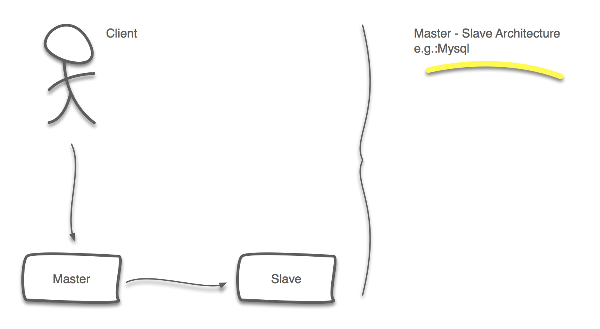
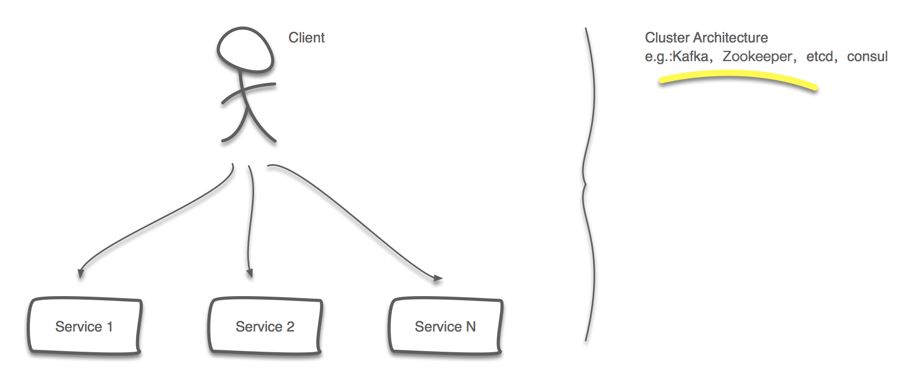
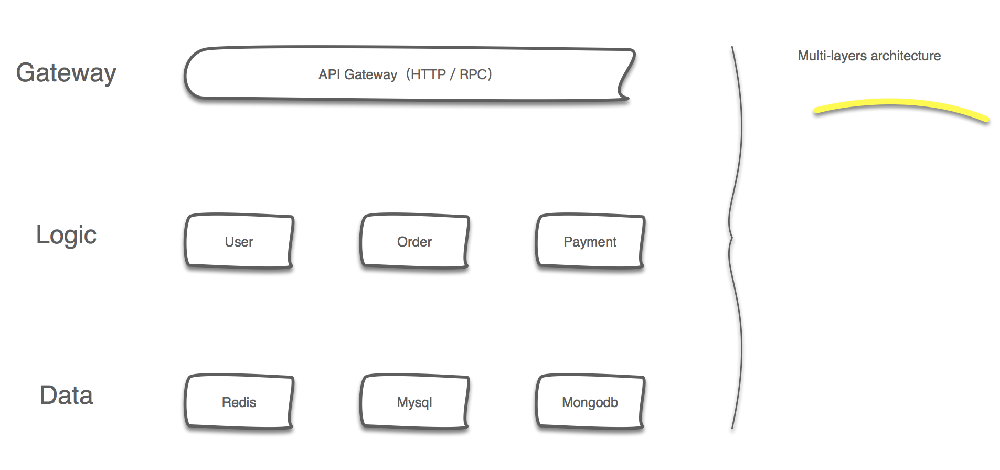
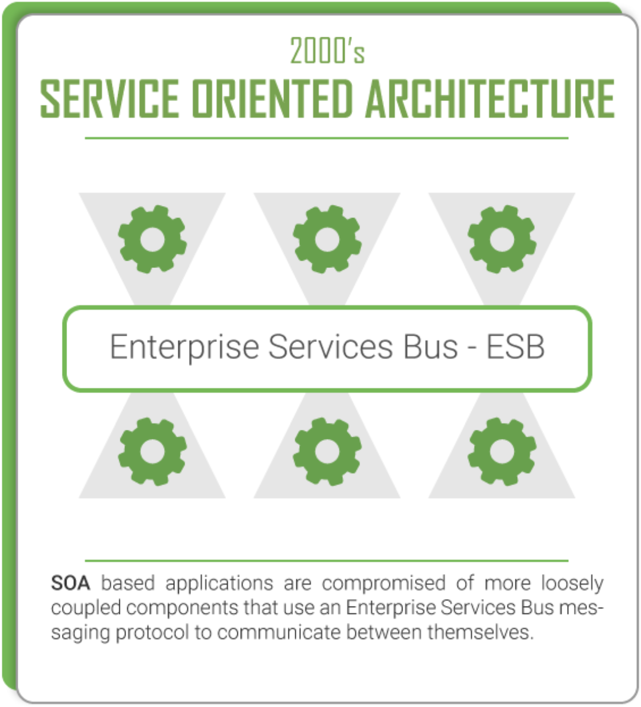
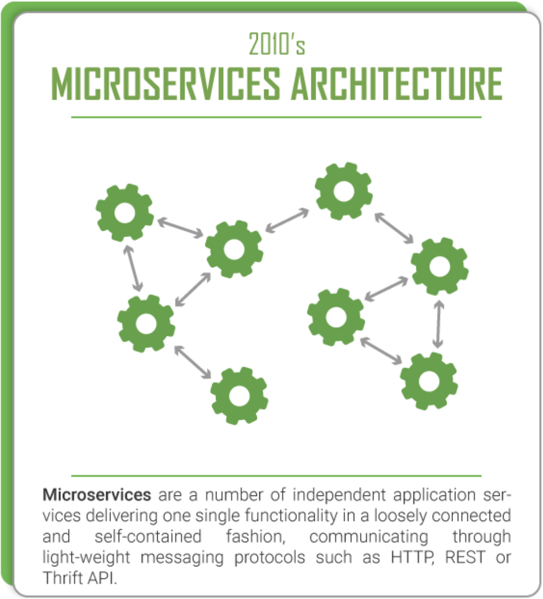
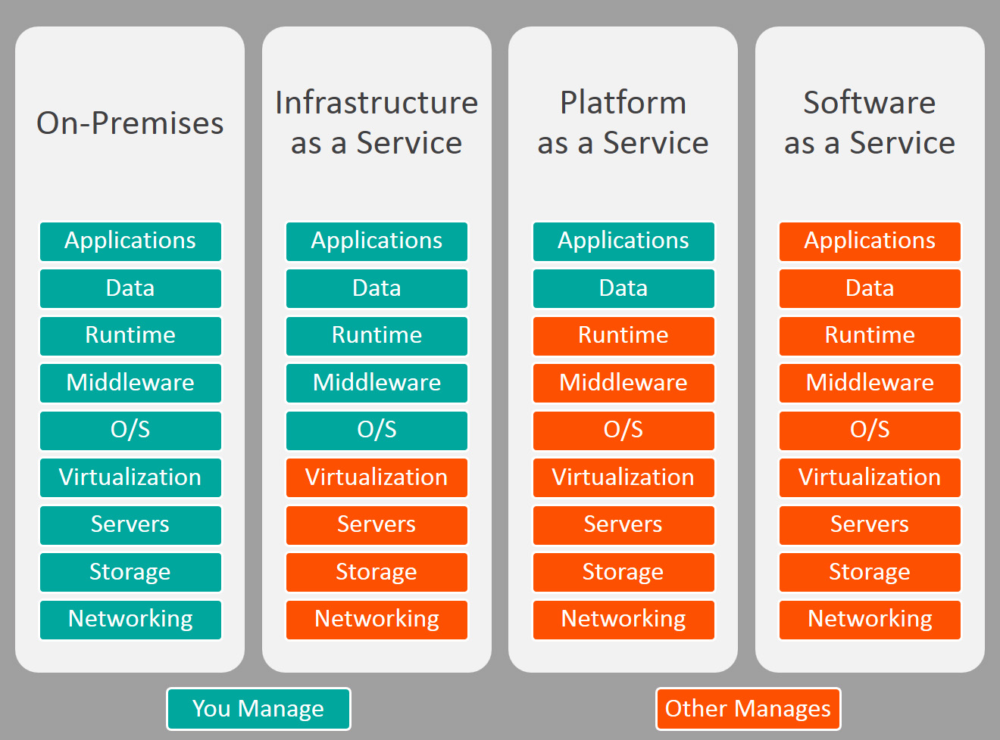

# 开源后台体系杂谈

**开源方案如此之多，眼花缭乱，我们该何去何从？**

PS：请大家脑补开源方案眼花缭乱的场景，以上图标也是花了好久找到，作图不易，且画且珍惜！

**当前开源项目情况，以上只是开源界的一角，由CNCF整理的landscape**

`由于不同的应用架构考量点是非常不同的，所以本文默认以互联网业务服务架构当作背景谈论问题。`

## 单体时代

### 背景

从互联网的发展历史来看，1969年美国，当时为了军事和科研用途，连接了几个美国高校的计算机，共享计算资源，以此展开了互联网的篇章。到现在互联网已经是现代人不可或缺的一部分。

当时的计算机资源是非常有限的，通常都是大型机，随着时间发展，计算机才走进个人，而互联网之初没有多少用户的，随着用户量和请求量的激增，相应的技术也被推动着升级换代。

但是在当时，一个单体架构的应用已经能满足所有需求。

### 优势

单体应用初始状态往往比较简单，存在很多优势，而且是非常显而易见的优势

反观很多大公司的架构发展历程，不少都是从单体模式起家的，不同时期根据当时的情况调整技术方案和路线

* 开发简单
* 容易测试
* 易于部署

### 劣势

随着时间的推移，越来越多的功能被加到项目中，开始变得臃肿，难以维护

这是单体应用变为了单体地狱，整个项目就像个泥潭

* 开发，维护，团队合作开始变得艰难
* 可靠性，扩展性逐渐变低
* 新技术引入面临巨大障碍
* 难以引入敏捷或持续交付

## 分布式时代

### 背景

当我们从单体时代到分布式时代转变的过程中，软件的开发模式，网络的拓扑，服务间的通讯，部署，管理等等都发生了巨大的变化，软件项目的复杂度也是直线提升。而这又对整个团队提了更高的要求，更稳定的质量，更快的交付，更频繁的发布。

这对整个团队是个很大的挑战，无论是在技术方面还是软件工程方面。

而恰恰许多开源项目都是因此而生，多数是为解决某一类问题而存在。

### 架构风格演变

#### 主从架构

主从架构在当今主要的是用在关系型数据库上

其主要目的：

 * 容灾，这个是最主要目的，提供了最基础的容灾能力，在Master发生故障时可以切换到Slave可以继续服务
 * 提高吞吐量，如DB提高读取QPS，往往Master和Slave的角色和功能会稍有差异

两种形式：

* 一主一备
* 一主多备

#### 多活架构

多活架构基本现在主要是组件级别的在使用，搭建组建集群

其主要目的：

* 容灾，通过多机对外提供服务，在某台机器或服务发生故障时可以访问其他节点继续服务
* 提高吞吐量，服务都是提供相同服务，可以通过平行扩容解决容量及吞吐量问题

要求：

由于是集群化提供服务，可动态缩扩容，所以就需要提供一定的服务发现和注册能力，方便用户使用。

为了提供更好的，可用性更高的服务，还需要引入负载均衡来选择一个service来提供服务。

#### Multitier Architecture（多层架构）

如果说多活架构是水平扩展，那么多层架构就是垂直拆分，根据大的功能类别把服务拆成三层

* 网关层（接入层）
  * 网关主要负责的是业务的接入，如HTTP或TCP／UDP等，处理一些通用逻辑，如鉴权，认证，流控等。
* 业务逻辑层
  * 主要负责具体业务逻辑的实现。
* 数据层
  * 主要负责数据的存储。

分层的好处显而易见，在日益增长的用户量和请求面前，每层明确自己的职责能更好的处理请求

而开发人员只要关注相关的业务逻辑即可

#### SOA（面向服务的架构）

> **面向服务的体系结构**（英语：service-oriented architecture）并不特指一种技术，而是一种分布式运算的软件设计方法。软件的部分组件(调用者)，可以通过网络上的通用协议调用另一个应用软件组件运行、运作，让调用者获得服务。SOA原则上采用[开放标准](https://zh.wikipedia.org/wiki/%E5%BC%80%E6%94%BE%E6%A0%87%E5%87%86)、与软件资源进行[交互](https://zh.wikipedia.org/w/index.php?title=%E4%BA%A4%E4%BA%92&action=edit&redlink=1)并采用表示的标准方式。因此应能跨越厂商、产品与技术。一项服务应视为一个独立的功能单元，可以远程访问并独立运行与更新，例如在线查询信用卡账单。 

在分层架构之后，随着业务的增长，业务逻辑逐渐复杂，简单的层次关系已经不足以表示整个的业务形态。

于是面向服务的架构诞生了，它定义了很多的标准，后面会讲的微服务其实也算SOA的一个子集。

SOA很重要的几个特点就是组件化，业务解耦，标准化通讯协议。

但是ESB的引入，解决了一定问题的同时，也带来了中心化的问题。这里中心化和去中心化又是一个话题。

对于SOA的具体定义请大家自行Google，不多做赘述，文末也有一些SOA和微服务的对比，当然仁者见仁，智者见智了。

#### Microservices（微服务架构）

>  **微服务** (Microservices) 是一种[软体架构风格](https://zh.wikipedia.org/wiki/%E8%BD%AF%E4%BB%B6%E6%9E%B6%E6%9E%84)，它是以专注于单一责任与功能的小型功能区块 (Small Building Blocks) 为基础，利用模组化的方式组合出复杂的大型应用程式，各功能区块使用与语言无关 (Language-Independent/Language agnostic) 的 API 集相互通讯。 

微服务是没有web服务规范和ESB（企业服务总线）的SOA，少了很多规范，更加灵活。严格意义上来说微服务是SOA的一个子集。

那么为服务又有哪些优点呢？

> 经过分离的组件可以各自拥有独立的生命周期，并且按需进行扩展。不仅如此，这种方式也打破了组件之间的技术依赖，这就允许每个服务各自选择最适合的技术进行实现。通过将较大的问题分解为几个较小的问题，让每个问题更易于进行分析，也更利于开发者选择最适合的解决方案。

没有任何服务是完美的，同样劣势和挑战依然存在。

> 通过这种方式对大问题进行分解也增加了整个解决方案的复杂度，尤其是在那些使用不同技术或方式创建各种服务的系统中体现得更为明显。这种架构将系统的整合点推移到了服务之间的接口，因此这些服务的接口需要进行良好的定义，在系统中也要对服务级别达成一致，并且还需要定义其他的非功能性需求。

业界做的比较好的是Netflix，来一张Netflix的经典架构图

#### 小结

现实工作中，各种架构风格之间的边界其实并没有那么清晰，往往是多种架构风格的结合。

而架构演进的方向则是不同纬度的拆解，由大拆小，缩小问题复杂度以应对日益复杂的业务需求。

SOA的应用更适用于企业，重业务流程的场景。

微服务则更适合互联网快速迭代的场景，亦较容易施行敏捷。

另外，世间本无完美的架构，架构本身是动态的，只有最适合当前的架构。

### 微服务的挑战（加上开源生态的解决方案）

#### 服务通讯

​	一般来说开源方案倾向于使用HTTP或某些RPC等方案来做为服务间的通讯方式。

​	e.g.:Restful, GraphQL, gRPC, thrift

#### 服务注册发现 & 负载均衡

​	最基础的服务注册与发现，也是互联网最大规模使用的当然就是DNS了，其他还有基于一些KV存储实现的。

​	e.g.:DNS, etcd, consul, zookeeper, eureka

​	而负载均衡则有很多方式，硬件的如F5，软件的也有很多。

​	e.g.:	LVS，HAProxy，Nginx，各种Service Mesh等

#### 服务监控

​	微服务的最大挑战之一也就是Observation，包括日志，监控&告警及调用链

​	**日志**

​		日志一般都是分为三块：收集，存储，展示。

​		开源社区的标配是ELK堆栈，即ElasticSearch + LogStash + Kibana。

​		e.g.:ELK, fluentd, 还有其他都是各种不同功能替换组合的方案

​	**监控 & 告警**

​		监控主要分为两类，同样分为收集，存储，展示三块，另加告警。

​		比较典型的方案是Promethes（被动收集），TICK（主动上报）等。

​		e.g.:Promethes, TICK, statsd, 还有其他各种不同功能替换组合的方案

​	**调用链**

​		开源社区主要是根据Google Dapper论文来实现调用链体系

​		e.g.:Zipkin, Jaeger

#### 服务容错

​	主要是Netflix的Hystrix（代码埋点）或使用一些如Nginx的反向代理。

​	Service Mesh看起来也会是更好的一个解决方案。

​	e.g.:Hystrix, Nginx, Envoy, Linkerd, Istio

#### 服务部署 & 管理

​	单体服务通常更易于部署，而微服务相对来说要求高了很多。相应的DevOps文化也盛行了起来。

​	这块目前微服务的主流是基于docker，在kubernetes平台上做编排。

​	e.g.:Docker, kubernetes, swarm, mesos, ansible, saltstack	

#### 其他

​	其他还包括服务安全，持续集成，持续部署等

​	服务安全，如OAuth等

​	CI，如Jenkins等

​	CD，如goCD等

#### 小结

​	使用微服务的挑战很多，不同的开源软件以自己不同的方式去尝试解决特定领域的问题。

​	现在已经不是缺粮少弹的时代，我们不需要造轮子，只需要选一款好用的即可。

​	那么基于开源堆栈的选型怎么选型？建议有过成功案例，社区活跃度高，github star多为主。

​	还有选型同样离不开业务和团队的现实情况，不同架构师有不同的选择，但是最终还是适合为主。

## IaaS，PaaS，SaaS & 现代开发模式

举个例子：

​	假设要开发一个提醒App，用户可以设置提醒的日期，内容及提醒方式。

​	那么在云时代，后台改如何开发呢，以腾讯云为例：

​	1.腾讯云（IaaS服务）申请机器，OK，申请3台（腾讯云CVM实例或k8s实例）

​	2.我们需要Mysql存储用户数据，需要消息队列做消息解耦，OK，腾讯云（PaaS服务）申请CDB和CKafka

​	3.我们的提醒功能还需要用短信提醒用户，OK，腾讯云（SaaS服务）申请短信SMS服务

​	4.下面根据申请的资源做coding

​		不需要关注机器，平行扩容？申请即可（IaaS解决）

​		不需要关注Mysql和CKafka性能，不够扩容即可（PaaS解决）

​		不需要关注更多标准能力，如APP push，需要申请腾讯云信鸽即可（SaaS解决）

​	以上就是云时代的开发模式，开发人员可以更关注于业务的实现，而把其他不需要关心的交给云来处理。

## 开源生态

#### CNCF（云原生计算基金会）

> CNCF，全称Cloud Native Computing Foundation（云原生计算基金会），口号是**坚持和整合开源技术来让编排容器作为微服务架构的一部分**，其作为致力于云原生应用推广和普及的一支重要力量，不论您是云原生应用的开发者、管理者还是研究人员都有必要了解。
>
> CNCF作为一个厂商中立的基金会，致力于Github上的快速成长的开源技术的推广，如Kubernetes、Prometheus、Envoy等，帮助开发人员更快更好的构建出色的产品。

#### 生态

  	目前开源生态我的明显体会是在融合。

​	虽然大家以自己不同的方式在解决不同类型的问题，但是融合的趋势不可避免。

​	随着CNCF的介入作为中立机构，推进开源生态的发展。这个趋势更是不可阻挡。

​	而且越来越多的SaaS供应商对业界流行的堆栈都做了极多的兼容，使得切换的代价变得小之又小。

## 展望

Service Mesh？

Serverless？

## 参考

[《Kubernetes Handbook》](https://jimmysong.io/kubernetes-handbook/) by jimmysong

[《Designing and Deploying Microservices》](https://www.nginx.com/resources/library/designing-deploying-microservices/) 英文版 by Chris Richardson

[《微服务：从设计到部署》](http://oopsguy.com/books/microservices/index.html)中文版 by 向阳（oopsguy）

[Microservices vs. SOA](https://dzone.com/articles/microservices-vs-soa-is-there-any-difference-at-al)

[SOA与微服务的比较和对比](http://www.infoq.com/cn/news/2015/12/soa-v-microservices)

[微服务、SOA 和 API：是敌是友？](https://www.ibm.com/developerworks/cn/websphere/library/techarticles/1601_clark-trs/1601_clark.html)

[SaaS vs PaaS vs IaaS: What’s The Difference and How To Choose](http://www.bmc.com/blogs/saas-vs-paas-vs-iaas-whats-the-difference-and-how-to-choose/)
